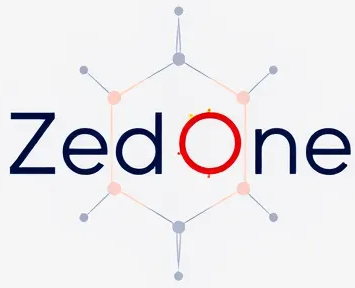

# SmartData AI


## 🚀 Introduction

Welcome to **SmartData AI**, an intelligent data analysis application that leverages the power of OpenAI's GPT-4 to provide insightful data queries and visualizations. Whether you're a data analyst, business professional, or enthusiast, SmartData AI simplifies data exploration by allowing you to interact with your datasets using natural language.

## 🛠 Features

- **CSV Upload:** Easily upload your CSV files for analysis.
- **Natural Language Queries:** Ask questions about your data and receive precise answers generated by AI.
- **Dynamic Visualizations:** Request visual representations of your data and get interactive Plotly charts.
- **Automated Schema Extraction:** Automatically extracts and summarizes the schema of your datasets.
- **Interactive Frontend:** User-friendly interface built with Streamlit for seamless interaction.
- **Robust Backend:** Powered by FastAPI to handle requests efficiently.

## 📈 Demo


## 🧰 Technologies Used

- **Backend:**
  - [FastAPI](https://fastapi.tiangolo.com/) - A modern, fast web framework for building APIs with Python.
  - [LangChain](https://langchain.com/) - Framework for developing applications powered by language models.
  - [OpenAI GPT-4](https://openai.com/product/gpt-4) - Advanced language model for generating intelligent responses.
  - [Plotly](https://plotly.com/python/) - Interactive graphing library for Python.

- **Frontend:**
  - [Streamlit](https://streamlit.io/) - An open-source app framework for Machine Learning and Data Science teams.
  - [Rich](https://rich.readthedocs.io/en/stable/) - Python library for rich text and beautiful formatting in the terminal.

- **Utilities:**
  - [Uvicorn](https://www.uvicorn.org/) - A lightning-fast ASGI server.
  - [dotenv](https://github.com/theskumar/python-dotenv) - Loads environment variables from a `.env` file.
  - [Logging](https://docs.python.org/3/library/logging.html) - Configurable logging for Python applications.

## 📦 Installation

### Prerequisites

- Python 3.8 or higher
- pip (Python package installer)

### Steps

1. **Clone the Repository**

   ```bash
   git clone https://github.com/your-username/smartdata-ai.git
   cd smartdata-ai
   ```

2. **Create a Virtual Environment**

   ```bash
   python -m venv venv
   ```

3. **Activate the Virtual Environment**

   - **Windows:**
     ```bash
     venv\Scripts\activate
     ```
   - **macOS/Linux:**
     ```bash
     source venv/bin/activate
     ```

4. **Install Dependencies**

   ```bash
   pip install -r requirements.txt
   ```

5. **Configure Environment Variables**

   Create a `.env` file in the root directory and add your OpenAI API key:

   ```env
   OPENAI_API_KEY=your_openai_api_key_here
   ```

## 🏃‍♂️ Usage

### Running the Application

To start both the FastAPI backend and the Streamlit frontend simultaneously, use the `run_all.py` script:

```bash
python run_all.py
```

- **FastAPI Backend:** Runs on `http://localhost:8000`
- **Streamlit Frontend:** Runs on `http://localhost:8501`

### Endpoints

#### 1. **Upload CSV**

- **URL:** `/upload_csv/`
- **Method:** `POST`
- **Description:** Upload a CSV file for analysis.
- **Parameters:**
  - `file`: The CSV file to upload.

#### 2. **Ask Question**

- **URL:** `/ask_question/`
- **Method:** `POST`
- **Description:** Ask a question about the uploaded CSV data.
- **Parameters:**
  - `question`: The question you want to ask.
  - `filename`: The name of the uploaded CSV file.

#### 3. **Visualize Data**

- **URL:** `/visualize/`
- **Method:** `POST`
- **Description:** Generate a Plotly visualization based on your question.
- **Parameters:**
  - `question`: The visualization request.
  - `filename`: The name of the uploaded CSV file.

### Streamlit Frontend

Access the Streamlit frontend at [http://localhost:8501](http://localhost:8501) after running the application. The interface allows you to:

- **Upload CSV Files:** Easily upload and manage your datasets.
- **Ask Questions:** Interact with your data using natural language queries.
- **Generate Visualizations:** Create insightful plots and charts based on your requests.

## 🗂 Project Structure

```
smartdata-ai/
├── agents/
│   ├── query_generator.py
│   ├── response_generator.py
│   └── visualizer.py
├── utils/
│   ├── data_loader.py
│   ├── schema_extractor.py
│   └── summary_generator.py
├── app.py
├── run_all.py
├── streamlit_app.py
├── requirements.txt
├── .env
├── README.md
└── banner.png
```

## 📝 Contributing

Contributions are welcome! Please follow these steps:

1. **Fork the Repository**
2. **Create a Feature Branch**

   ```bash
   git checkout -b feature/YourFeature
   ```

3. **Commit Your Changes**

   ```bash
   git commit -m "Add your message"
   ```

4. **Push to the Branch**

   ```bash
   git push origin feature/YourFeature
   ```

5. **Open a Pull Request**

## 🛡 License

This project is licensed under the [MIT License](LICENSE).

## 📞 Contact

For any inquiries or support, please contact [hossein.karimi.0128@gmail.com](mailto:hossein.karimi.0128@gmail.com).

---
```